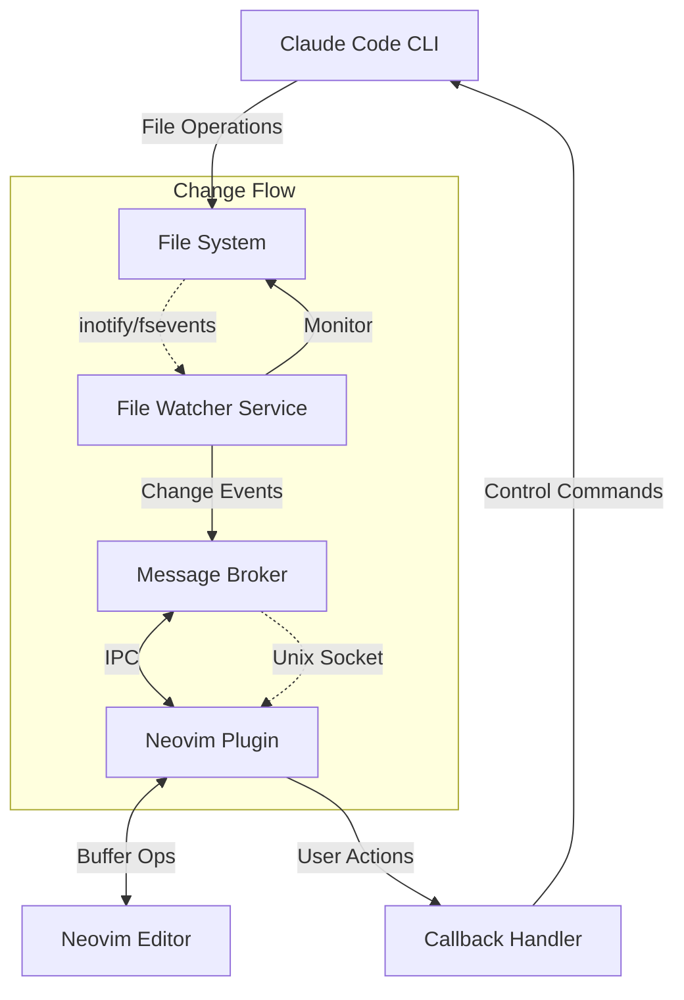
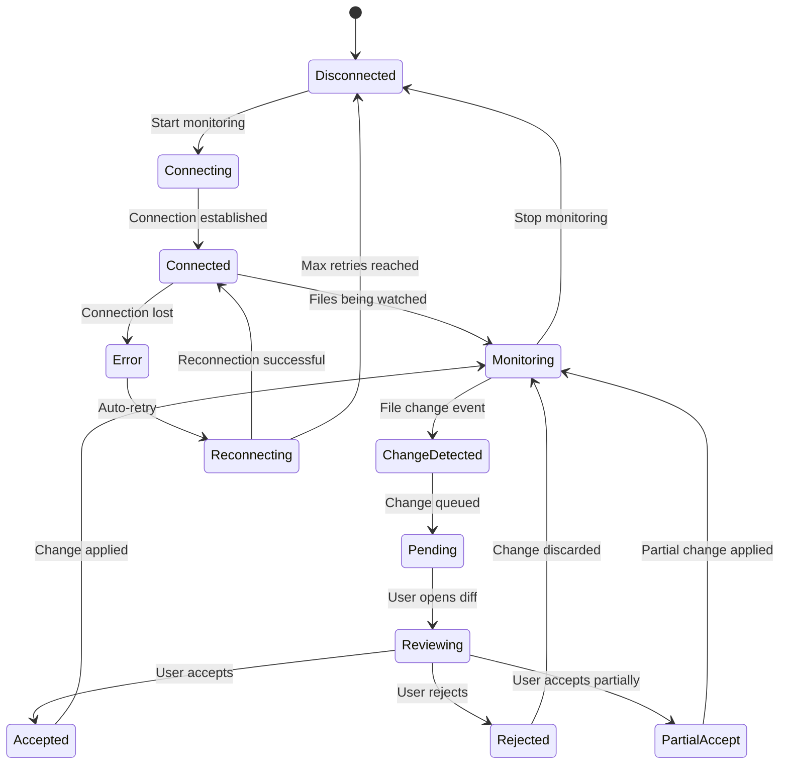

# Claude Code + Neovim Integration - System Architecture

## 1. System Overview



## 2. Component Architecture

### 2.1 Core Components

```
┌─────────────────────────────────────────────────────────────┐
│                     System Architecture                      │
├───────────────────────────────────────────────────────────────┤
│                                                               │
│  ┌─────────────┐         ┌─────────────┐                    │
│  │Claude Code  │────────▶│File System  │                    │
│  │    CLI      │ writes  │             │                    │
│  └─────────────┘         └──────┬──────┘                    │
│                                  │                           │
│                           watches│                           │
│                                  ▼                           │
│  ┌─────────────────────────────────────────────┐            │
│  │         File Watcher Service                 │            │
│  │  ┌──────────┐  ┌──────────┐  ┌──────────┐  │            │
│  │  │FS Events │  │  Differ  │  │  Queue   │  │            │
│  │  │ Handler  │──│  Engine  │──│ Manager  │  │            │
│  │  └──────────┘  └──────────┘  └──────────┘  │            │
│  └───────────────────┬─────────────────────────┘            │
│                      │                                       │
│                 IPC  │ Unix Socket/Named Pipe                │
│                      ▼                                       │
│  ┌─────────────────────────────────────────────┐            │
│  │           Neovim Plugin (Lua)                │            │
│  │  ┌──────────┐  ┌──────────┐  ┌──────────┐  │            │
│  │  │  Event   │  │  Buffer  │  │    UI    │  │            │
│  │  │ Receiver │──│ Manager  │──│ Renderer │  │            │
│  │  └──────────┘  └──────────┘  └──────────┘  │            │
│  └─────────────────────────────────────────────┘            │
│                                                              │
└──────────────────────────────────────────────────────────────┘
```

### 2.2 Component Descriptions

#### File Watcher Service (Python/Node.js/Go)
**Responsibilities:**
- Monitor file system for changes
- Calculate diffs for modified files
- Queue changes for delivery
- Manage connection to Neovim

**Key Classes:**
```python
class FileWatcher:
    - watch_directory(path: str)
    - on_file_change(event: FileEvent)
    - calculate_diff(old: str, new: str)
    
class ChangeQueue:
    - enqueue(change: FileChange)
    - dequeue() -> FileChange
    - get_pending() -> List[FileChange]
    
class IPCServer:
    - start_server(socket_path: str)
    - send_change(change: FileChange)
    - receive_command(cmd: Command)
```

#### Neovim Plugin (Lua)
**Responsibilities:**
- Receive change notifications
- Update buffers with changes
- Render UI elements
- Handle user interactions

**Key Modules:**
```lua
-- Main plugin module
M.setup(config)
M.start_monitoring()
M.stop_monitoring()

-- Event handler
M.on_file_change(change)
M.on_user_action(action)

-- Buffer management
M.update_buffer(bufnr, changes)
M.create_diff_view(changes)
M.apply_changes(changes)
M.reject_changes(changes)

-- UI rendering
M.show_notification(message)
M.render_diff_window(diff)
M.update_statusline(status)
```

#### Message Broker
**Responsibilities:**
- Manage IPC communication
- Message serialization/deserialization
- Connection management
- Error handling

**Protocol:**
```json
{
  "type": "FILE_CHANGE",
  "timestamp": "2024-01-20T10:30:00Z",
  "file": "/path/to/file.js",
  "action": "MODIFY",
  "diff": {
    "hunks": [
      {
        "start_line": 10,
        "end_line": 15,
        "old_text": "...",
        "new_text": "..."
      }
    ]
  }
}
```

## 3. Data Flow Architecture

### 3.1 Change Detection Flow

```
1. Claude Code modifies file
    ↓
2. File system event triggered
    ↓
3. File Watcher captures event
    ↓
4. Diff calculation performed
    ↓
5. Change packaged as message
    ↓
6. Message sent via IPC
    ↓
7. Neovim plugin receives message
    ↓
8. Plugin updates buffer/UI
    ↓
9. User reviews changes
    ↓
10. Accept/Reject action
```

### 3.2 Communication Protocol

#### Message Types
```typescript
enum MessageType {
  FILE_CHANGE = "FILE_CHANGE",
  FILE_CREATE = "FILE_CREATE",
  FILE_DELETE = "FILE_DELETE",
  BULK_CHANGES = "BULK_CHANGES",
  ACCEPT_CHANGE = "ACCEPT_CHANGE",
  REJECT_CHANGE = "REJECT_CHANGE",
  REQUEST_DIFF = "REQUEST_DIFF",
  STATUS_UPDATE = "STATUS_UPDATE",
  ERROR = "ERROR"
}

interface Message {
  id: string;
  type: MessageType;
  timestamp: Date;
  payload: any;
}

interface FileChange {
  file_path: string;
  change_type: "CREATE" | "MODIFY" | "DELETE";
  diff?: Diff;
  content?: string;
  metadata?: {
    size: number;
    permissions: string;
    encoding: string;
  };
}
```

## 4. State Management

### 4.1 State Diagram



### 4.2 State Storage

```lua
-- Neovim plugin state
local state = {
  connection = {
    status = "disconnected",
    socket_path = nil,
    retry_count = 0
  },
  pending_changes = {}, -- Array of pending changes
  change_history = {},  -- Recent changes
  buffers = {
    -- Map of buffer_id to change tracking
    [bufnr] = {
      file_path = "/path/to/file",
      pending_changes = {},
      original_content = "",
      modified = false
    }
  },
  config = {
    auto_accept = false,
    show_notifications = true,
    diff_preview = true
  }
}
```

## 5. Security Architecture

### 5.1 Security Layers

```
┌─────────────────────────────────────┐
│         Security Architecture        │
├─────────────────────────────────────┤
│                                     │
│  ┌────────────────────────────┐    │
│  │   Authentication Layer      │    │
│  │  - Socket permissions       │    │
│  │  - Process verification     │    │
│  └────────────────────────────┘    │
│                                     │
│  ┌────────────────────────────┐    │
│  │   Authorization Layer       │    │
│  │  - File access control      │    │
│  │  - Operation permissions    │    │
│  └────────────────────────────┘    │
│                                     │
│  ┌────────────────────────────┐    │
│  │   Data Protection Layer     │    │
│  │  - Message encryption       │    │
│  │  - Secure file operations   │    │
│  └────────────────────────────┘    │
│                                     │
│  ┌────────────────────────────┐    │
│  │   Audit & Logging Layer     │    │
│  │  - Change tracking          │    │
│  │  - Access logs              │    │
│  └────────────────────────────┘    │
│                                     │
└─────────────────────────────────────┘
```

### 5.2 Security Measures

1. **IPC Security**
   - Unix socket with restricted permissions (0600)
   - Process ID verification
   - Message signing/validation

2. **File Operations**
   - Preserve original file permissions
   - Atomic write operations
   - Backup before modifications

3. **Input Validation**
   - Sanitize file paths
   - Validate message format
   - Prevent injection attacks

## 6. Deployment Architecture

### 6.1 Installation Components

```
claude-code-nvim/
├── file-watcher/
│   ├── watcher.py           # Main watcher service
│   ├── requirements.txt     # Python dependencies
│   └── config.yaml          # Configuration
├── nvim-plugin/
│   ├── lua/
│   │   └── claude-code-nvim/
│   │       ├── init.lua     # Plugin entry point
│   │       ├── events.lua   # Event handling
│   │       ├── buffer.lua   # Buffer management
│   │       └── ui.lua       # UI components
│   └── plugin/
│       └── claude-code-nvim.vim  # Vim commands
├── scripts/
│   ├── install.sh           # Installation script
│   ├── start.sh            # Start services
│   └── stop.sh             # Stop services
└── config/
    └── default.yaml        # Default configuration
```

### 6.2 Service Management

```bash
# Systemd service (Linux)
[Unit]
Description=Claude Code File Watcher
After=network.target

[Service]
Type=simple
User=%i
ExecStart=/usr/bin/python3 /path/to/watcher.py
Restart=on-failure
RestartSec=10

[Install]
WantedBy=multi-user.target

# LaunchAgent (macOS)
<?xml version="1.0" encoding="UTF-8"?>
<!DOCTYPE plist PUBLIC "-//Apple//DTD PLIST 1.0//EN">
<plist version="1.0">
<dict>
    <key>Label</key>
    <string>com.claude-code-nvim.watcher</string>
    <key>ProgramArguments</key>
    <array>
        <string>/usr/bin/python3</string>
        <string>/path/to/watcher.py</string>
    </array>
    <key>RunAtLoad</key>
    <true/>
    <key>KeepAlive</key>
    <true/>
</dict>
</plist>
```

## 7. Performance Considerations

### 7.1 Optimization Strategies

1. **File Watching**
   - Use native OS file watching APIs
   - Batch multiple rapid changes
   - Ignore temporary files and directories
   - Implement debouncing for rapid changes

2. **Diff Calculation**
   - Use efficient diff algorithms (Myers, Patience)
   - Cache recent file contents
   - Limit diff size for large files
   - Async diff calculation

3. **IPC Communication**
   - Message compression for large diffs
   - Connection pooling
   - Async message handling
   - Binary protocol for efficiency

4. **Neovim Integration**
   - Lazy loading of plugin components
   - Virtual text instead of buffer modifications
   - Incremental UI updates
   - Debounced status line updates

### 7.2 Resource Limits

```yaml
performance:
  max_file_size: 10MB
  max_diff_size: 1MB
  max_pending_changes: 100
  max_watches: 10000
  
  debounce:
    file_change: 100ms
    ui_update: 50ms
    status_update: 500ms
  
  cache:
    max_files: 100
    ttl: 3600s
    max_memory: 50MB
```

## 8. Error Handling & Recovery

### 8.1 Error Scenarios

```
┌──────────────────┬────────────────┬──────────────────┐
│   Error Type     │   Detection    │    Recovery      │
├──────────────────┼────────────────┼──────────────────┤
│ Connection Lost  │ Heartbeat fail │ Auto-reconnect   │
│ File Lock        │ Write failure  │ Retry with delay │
│ Invalid Diff     │ Parse error    │ Full file reload │
│ Memory Limit     │ Usage check    │ Cache eviction   │
│ Watch Limit      │ OS error       │ Priority queue   │
│ Corrupt Message  │ Checksum fail  │ Request resend   │
└──────────────────┴────────────────┴──────────────────┘
```

### 8.2 Recovery Strategies

1. **Exponential Backoff**
   - Initial retry: 100ms
   - Max retry: 30s
   - Max attempts: 10

2. **Circuit Breaker**
   - Failure threshold: 5
   - Reset timeout: 60s
   - Half-open testing

3. **Graceful Degradation**
   - Fallback to polling if watching fails
   - Local diff if service unavailable
   - Manual reload option

## 9. Testing Architecture

### 9.1 Test Pyramid

```
         ┌────┐
         │ E2E│  5%
        ┌┴────┴┐
        │ Intg │  15%
       ┌┴──────┴┐
       │  Unit  │  80%
       └────────┘
```

### 9.2 Test Categories

1. **Unit Tests**
   - Diff algorithm accuracy
   - Message parsing/serialization
   - State management
   - Error handling

2. **Integration Tests**
   - IPC communication
   - File system operations
   - Neovim API interactions
   - Service coordination

3. **End-to-End Tests**
   - Full workflow scenarios
   - Performance benchmarks
   - Stress testing
   - Recovery scenarios

## 10. Monitoring & Observability

### 10.1 Metrics

```yaml
metrics:
  performance:
    - change_detection_latency
    - diff_calculation_time
    - message_transmission_time
    - ui_update_latency
  
  reliability:
    - connection_uptime
    - error_rate
    - retry_count
    - recovery_time
  
  usage:
    - changes_per_minute
    - files_monitored
    - active_buffers
    - user_actions
```

### 10.2 Logging

```python
# Structured logging format
{
  "timestamp": "2024-01-20T10:30:00Z",
  "level": "INFO",
  "component": "FileWatcher",
  "event": "FILE_CHANGE_DETECTED",
  "data": {
    "file": "/path/to/file.js",
    "size": 1024,
    "action": "MODIFY"
  },
  "trace_id": "abc123",
  "span_id": "def456"
}
```

## 11. Future Architecture Considerations

### 11.1 Scalability Path

1. **Multi-project Support**
   - Project isolation
   - Configuration per project
   - Resource allocation

2. **Distributed Architecture**
   - Multiple watcher instances
   - Load balancing
   - Shared state management

3. **Plugin Ecosystem**
   - Extension API
   - Custom handlers
   - Third-party integrations

### 11.2 Technology Upgrades

1. **LSP Integration**
   - Language Server Protocol support
   - Semantic diff understanding
   - Code intelligence

2. **AI Enhancement**
   - Smart conflict resolution
   - Change prediction
   - Automated testing

3. **Cloud Sync**
   - Remote development support
   - Multi-device sync
   - Collaborative editing